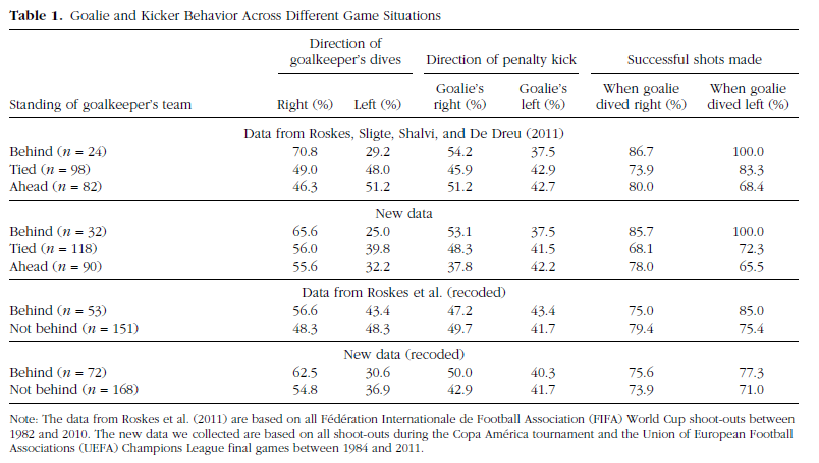

```{r}
articleID <- "16-11-2014_PS" # insert the article ID code here e.g., "10-3-2015_PS"
reportType <- 'final'
pilotNames <- "Yochai Shavit, Kari Leibowitz" # insert the pilot's name here e.g., "Tom Hardwicke". If there are multiple pilots enter both names in a character string e.g., "Tom Hardwicke, Bob Dylan"
copilotNames <- "Tom Hardwicke" # insert the co-pilot's name here e.g., "Michael Frank". If there are multiple co-pilots enter both names in a character string e.g., "Tom Hardwicke, Bob Dylan"
pilotTTC <- 360 # insert the pilot's estimated time to complete (in minutes, fine to approximate) e.g., 120
copilotTTC <- 30 # insert the co- pilot's estimated time to complete (in minutes, fine to approximate) e.g., 120
pilotStartDate <- as.Date("11/1/17", format = "%m/%d/%y") # insert the pilot's start date in US format e.g., as.Date("01/25/18", format = "%m/%d/%y")
copilotStartDate <- as.Date("04/22/19", format = "%m/%d/%y") # insert the co-pilot's start date in US format e.g., as.Date("01/25/18", format = "%m/%d/%y")
completionDate <- as.Date("04/22/19", format = "%m/%d/%y") # copilot insert the date of final report completion (after any necessary rounds of author assistance) in US format e.g., as.Date("01/25/18", format = "%m/%d/%y")
```

-------

#### Methods summary: 
Price and Wolfers attempted to replicate the findings reported in Roskes, Sligte, Shalvi, & DeDreu (2011), that when their team is behind, goalkeepers tend to jump to their right side during penalty kicks, thus exhibiting a right-oriented bias resulting from approach motivation. 

In the current article, the authors recorded data on 240 penalty kicks taken during penalty kick shoot-outs of matches in the UEFA champions league's final games and the Copa America soccer competitions, between the years 1984 and 2011. For each penalty kick the following information was coded by three independent observers: The keeper's team position during the kick (leading, tied, or behind), the direction of the penalty taker's shot (left, middle, or right), the direction in which the goalkeeper dove (left, middle, or right), and the outcome of the shot (score, save, or off-target). Coders were in general agreement with one another (agreed on 93% of penalty kicks and consensus was achieved for the remaining 7%).

------

#### Target outcomes: 

>> In Table 1, we provide the main results using both
Roskes et al.’s data and the new data that we collected.
The earlier study revealed a greater propensity for the
goalkeepers to dive to the right when their team was
behind (70.8%) versus when their team was tied or ahead
(49.0% and 46.3%, respectively). Our new data show a
smaller difference based on the game situation (65.6%
when their team was behind, 56.0% when tied, 55.6%
when ahead), and none of these percentages are statistically
significantly different from each other.

*Figure 1. Price & Wolfers descriptive table*


------


```{r global_options, include=FALSE}
knitr::opts_chunk$set(echo=TRUE, warning=FALSE, message=FALSE)
```

## Step 1: Load packages

```{r}
library(tidyverse) # for data munging
library(knitr) # for kable table formating
library(haven) # import and export 'SPSS', 'Stata' and 'SAS' Files
library(readxl) # import excel files
library(ReproReports) # custom report functions
library(car)
library(pander)
```

```{r}
# Prepare report object. This will be updated automatically by the reproCheck function each time values are compared.
reportObject <- data.frame(dummyRow = TRUE, reportedValue = NA, obtainedValue = NA, valueType = NA, percentageError = NA, comparisonOutcome = NA, eyeballCheck = NA)
```

## Step 2: Load data

```{r}
df=read_dta("data/price_wolfers.dta")
```

## Step 3: Tidy data

```{r}
#First- retain only the variables that were recorded: direction of shot, direction of dive, what was the result of the kick and what was the score at the time.

df_tidy=df%>%select(id=id,team_pos=keeper_score, new_pos=new_score, shot_dir=directionshot, dive_dir=directiondive, rslt=result2, score=score)

#data structure
#str(df_tidy) #-> all of these are charachters. should be changed to factors
df_tidy$id=as.factor(df_tidy$id)
df_tidy$team_pos=as.factor(df_tidy$team_pos)
df_tidy$new_pos=as.factor(df_tidy$new_pos)
df_tidy$shot_dir=as.factor(df_tidy$shot_dir)
df_tidy$dive_dir=as.factor(df_tidy$dive_dir)
df_tidy$rslt=as.factor(df_tidy$rslt)
df_tidy$score=as.factor(df_tidy$score)

#Second- recode values of 'team_pos' to match what is reported in table 1
df_tidy$team_pos=recode(df_tidy$team_pos, "'a_behind'='1.Behind'; 'atie'='2.Tie'; 'z_ahead'='3.Ahead'")
```

## Step 4: Run analysis

### Pre-processing

```{r}
 #set an object for number of shots in each position condition (team_pos and pos_new)
n_behind_old=sum(df_tidy$team_pos=="1.Behind")
n_tie_old=sum(df_tidy$team_pos=="2.Tie")
n_ahead_old=sum(df_tidy$team_pos=="3.Ahead")

n_behind_new=sum(df_tidy$new_pos=='behind')
n_not_new=sum(df_tidy$new_pos=='not behind')

#Recode shot_direction to reflect the direction from the goalie's perspective (rather than that of the penalty-taker's shot)
df_tidy$shot_dir_rv=recode(df_tidy$shot_dir, "'right'='left'; 'center'='center'; 'left'='right'")
```

### Descriptive statistics

```{r}
#first- count the number of cases in each 'pos' condition
pos_old=table(df_tidy$team_pos)
pos_new=table(df_tidy$new_pos)
```

At first, we wanted to make sure that we can get the same number of "behind", "tie", and "ahead" cases in the Roskes et al. coding scheme, and the same number of "behind" and "not behind" cases in the new coding scheme.

`r pander(pos_old, caption="table 1: Case counts- Old coding")`

`r pander(pos_new, caption="table 2: Case counts- New coding")`

As can be seen from the tables above- the counts are the same as those reported in Price & Wolfers' table 1 in both cases. 

Report:

```{r}
reportObject <- reproCheck(reportedValue = '32', obtainedValue = pos_old[1], valueType = 'n')

reportObject <- reproCheck(reportedValue = '118', obtainedValue = pos_old[2], valueType = 'n')

reportObject <- reproCheck(reportedValue = '90', obtainedValue = pos_old[3], valueType = 'n')

reportObject <- reproCheck(reportedValue = '72', obtainedValue = pos_new[1], valueType = 'n')

reportObject <- reproCheck(reportedValue = '168', obtainedValue = pos_new[2], valueType = 'n')
```


```{r}
#Now- get the percent values
old_pos=df_tidy%>%group_by(team_pos)%>%summarise(dive_right=sum(dive_dir=='right'), dive_left=sum(dive_dir=='left'), shot_goalie_right=sum(shot_dir_rv=='right'), shot_goalie_left=sum(shot_dir_rv=='left'))%>%ungroup()

old_pos$dive_right[1]=round(((old_pos$dive_right[1]/n_behind_old)*100),1) 
old_pos$dive_right[2]=round(((old_pos$dive_right[2]/n_tie_old)*100),1)
old_pos$dive_right[3]=round(((old_pos$dive_right[3]/n_ahead_old)*100),1)
old_pos$dive_left[1]=round(((old_pos$dive_left[1]/n_behind_old)*100),1)
old_pos$dive_left[2]=round(((old_pos$dive_left[2]/n_tie_old)*100),1)
old_pos$dive_left[3]=round(((old_pos$dive_left[3]/n_ahead_old)*100),1)
old_pos$shot_goalie_right[1]=round(((old_pos$shot_goalie_right[1]/n_behind_old)*100),1)
old_pos$shot_goalie_right[2]=round(((old_pos$shot_goalie_right[2]/n_tie_old)*100),1)
old_pos$shot_goalie_right[3]=round(((old_pos$shot_goalie_right[3]/n_ahead_old)*100),1)
old_pos$shot_goalie_left[1]=round(((old_pos$shot_goalie_left[1]/n_behind_old)*100),1)
old_pos$shot_goalie_left[2]=round(((old_pos$shot_goalie_left[2]/n_tie_old)*100),1)
old_pos$shot_goalie_left[3]=round(((old_pos$shot_goalie_left[3]/n_ahead_old)*100),1)
```

All seem to match. Record:

```{r}
reportObject <- reproCheck(reportedValue = '65.6', obtainedValue = old_pos %>% filter(team_pos == "1.Behind") %>% pull(dive_right), valueType = 'n')

reportObject <- reproCheck(reportedValue = '56.0', obtainedValue = old_pos %>% filter(team_pos == "2.Tie") %>% pull(dive_right), valueType = 'n')

reportObject <- reproCheck(reportedValue = '55.6', obtainedValue = old_pos %>% filter(team_pos == "3.Ahead") %>% pull(dive_right), valueType = 'n')

reportObject <- reproCheck(reportedValue = '25.0', obtainedValue = old_pos %>% filter(team_pos == "1.Behind") %>% pull(dive_left), valueType = 'n')

reportObject <- reproCheck(reportedValue = '39.8', obtainedValue = old_pos %>% filter(team_pos == "2.Tie") %>% pull(dive_left), valueType = 'n')

reportObject <- reproCheck(reportedValue = '32.2', obtainedValue = old_pos %>% filter(team_pos == "3.Ahead") %>% pull(dive_left), valueType = 'n')

reportObject <- reproCheck(reportedValue = '53.1', obtainedValue = old_pos %>% filter(team_pos == "1.Behind") %>% pull(shot_goalie_right), valueType = 'n')

reportObject <- reproCheck(reportedValue = '48.3', obtainedValue = old_pos %>% filter(team_pos == "2.Tie") %>% pull(shot_goalie_right), valueType = 'n')

reportObject <- reproCheck(reportedValue = '37.8', obtainedValue = old_pos %>% filter(team_pos == "3.Ahead") %>% pull(shot_goalie_right), valueType = 'n')

reportObject <- reproCheck(reportedValue = '37.5', obtainedValue = old_pos %>% filter(team_pos == "1.Behind") %>% pull(shot_goalie_left), valueType = 'n')

reportObject <- reproCheck(reportedValue = '41.5', obtainedValue = old_pos %>% filter(team_pos == "2.Tie") %>% pull(shot_goalie_left), valueType = 'n')

reportObject <- reproCheck(reportedValue = '42.2', obtainedValue = old_pos %>% filter(team_pos == "3.Ahead") %>% pull(shot_goalie_left), valueType = 'n')
```

```{r}
#Next- do the same with the new coding
new_pos=df_tidy%>%group_by(new_pos)%>%summarise(dive_right=sum(dive_dir=='right'), dive_left=sum(dive_dir=='left'), shot_goalie_right=sum(shot_dir_rv=='right'), shot_goalie_left=sum(shot_dir_rv=='left'))%>%ungroup()

new_pos$dive_right[1]=round(((new_pos$dive_right[1]/n_behind_new)*100),1) 
new_pos$dive_right[2]=round(((new_pos$dive_right[2]/n_not_new)*100),1)
new_pos$dive_left[1]=round(((new_pos$dive_left[1]/n_behind_new)*100),1)
new_pos$dive_left[2]=round(((new_pos$dive_left[2]/n_not_new)*100),1)
new_pos$shot_goalie_right[1]=round(((new_pos$shot_goalie_right[1]/n_behind_new)*100),1)
new_pos$shot_goalie_right[2]=round(((new_pos$shot_goalie_right[2]/n_not_new)*100),1)
new_pos$shot_goalie_left[1]=round(((new_pos$shot_goalie_left[1]/n_behind_new)*100),1)
new_pos$shot_goalie_left[2]=round(((new_pos$shot_goalie_left[2]/n_not_new)*100),1)
```

All seems to match.

```{r}
reportObject <- reproCheck(reportedValue = '62.5', obtainedValue = new_pos %>% filter(new_pos == "behind") %>% pull(dive_right), valueType = 'n')

reportObject <- reproCheck(reportedValue = '54.8', obtainedValue = new_pos %>% filter(new_pos == "not behind") %>% pull(dive_right), valueType = 'n')

reportObject <- reproCheck(reportedValue = '30.6', obtainedValue = new_pos %>% filter(new_pos == "behind") %>% pull(dive_left), valueType = 'n')

reportObject <- reproCheck(reportedValue = '36.9', obtainedValue = new_pos %>% filter(new_pos == "not behind") %>% pull(dive_left), valueType = 'n')

reportObject <- reproCheck(reportedValue = '50', obtainedValue = new_pos %>% filter(new_pos == "behind") %>% pull(shot_goalie_right), valueType = 'n')

reportObject <- reproCheck(reportedValue = '42.9', obtainedValue = new_pos %>% filter(new_pos == "not behind") %>% pull(shot_goalie_right), valueType = 'n')

reportObject <- reproCheck(reportedValue = '40.3', obtainedValue = new_pos %>% filter(new_pos == "behind") %>% pull(shot_goalie_left), valueType = 'n')

reportObject <- reproCheck(reportedValue = '41.7', obtainedValue = new_pos %>% filter(new_pos == "not behind") %>% pull(shot_goalie_left), valueType = 'n')
```

Next, we attempted to replicate the values in the last two columns of table 1, in row sets 2 & 4 (percent of successful shots when the goalie dove left/ right in each of the "team-position" coding schemes). 

```{r}
##Old coding
#count cases of keepers' dives 
dir_dive_by_teampos=table(df_tidy$dive_dir, df_tidy$team_pos) #-> table with counts
#pull values from table
n_left_b_old=dir_dive_by_teampos[2,1]
n_left_t_old=dir_dive_by_teampos[2,2]
n_left_a_old=dir_dive_by_teampos[2,3]
n_right_b_old=dir_dive_by_teampos[3,1]
n_right_t_old=dir_dive_by_teampos[3,2]
n_right_a_old=dir_dive_by_teampos[3,3]

# Old coding successful shots by direction of dive and team position-count
old_suc=df_tidy%>%filter(dive_dir=="right" | dive_dir=="left")%>%group_by(team_pos, dive_dir)%>%summarise(suc_count=sum(rslt=='goal'))%>%ungroup()

#Recode into percetenge of dives in that direction 
old_suc$suc_count[1]=round(((old_suc$suc_count[1]/n_left_b_old)*100),1)
old_suc$suc_count[2]=round(((old_suc$suc_count[2]/n_right_b_old)*100),1)
old_suc$suc_count[3]=round(((old_suc$suc_count[3]/n_left_t_old)*100),1)
old_suc$suc_count[4]=round(((old_suc$suc_count[4]/n_right_t_old)*100),1)
old_suc$suc_count[5]=round(((old_suc$suc_count[5]/n_left_a_old)*100),1)
old_suc$suc_count[6]=round(((old_suc$suc_count[6]/n_right_a_old)*100),1)
```

No differences. Report:

```{r}
reportObject <- reproCheck(reportedValue = '100', obtainedValue = old_suc %>% filter(team_pos == "1.Behind", dive_dir == "left") %>% pull(suc_count), valueType = 'n')

reportObject <- reproCheck(reportedValue = '85.7', obtainedValue = old_suc %>% filter(team_pos == "1.Behind", dive_dir == "right") %>% pull(suc_count), valueType = 'n')

reportObject <- reproCheck(reportedValue = '72.3', obtainedValue = old_suc %>% filter(team_pos == "2.Tie", dive_dir == "left") %>% pull(suc_count), valueType = 'n')

reportObject <- reproCheck(reportedValue = '68.2', obtainedValue = old_suc %>% filter(team_pos == "2.Tie", dive_dir == "right") %>% pull(suc_count), valueType = 'n')

reportObject <- reproCheck(reportedValue = '65.5', obtainedValue = old_suc %>% filter(team_pos == "3.Ahead", dive_dir == "left") %>% pull(suc_count), valueType = 'n')

reportObject <- reproCheck(reportedValue = '78.0', obtainedValue = old_suc %>% filter(team_pos == "3.Ahead", dive_dir == "right") %>% pull(suc_count), valueType = 'n')
```

```{r}
##New coding 
#count cases of keepers' dives 
dir_dive_by_newpos=table(df_tidy$dive_dir, df_tidy$new_pos) #-> table with counts
#pull values from table
n_left_b_new=dir_dive_by_newpos[2,1]
n_left_not_new=dir_dive_by_newpos[2,2]
n_right_b_new=dir_dive_by_newpos[3,1]
n_right_not_new=dir_dive_by_newpos[3,2]

# New coding scheme successful shots by direction of dive and team position-count
new_suc=df_tidy%>%filter(dive_dir=="right" | dive_dir=="left")%>%group_by(new_pos, dive_dir)%>%summarise(suc_count=sum(rslt=='goal'))%>%ungroup()

#Recode into percetenge of dives in that direction 
new_suc$suc_count[1]=round(((new_suc$suc_count[1]/n_left_b_new)*100),1)
new_suc$suc_count[2]=round(((new_suc$suc_count[2]/n_right_b_new)*100),1)
new_suc$suc_count[3]=round(((new_suc$suc_count[3]/n_left_not_new)*100),1)
new_suc$suc_count[4]=round(((new_suc$suc_count[4]/n_right_not_new)*100),1)

```

```{r}
reportObject <- reproCheck(reportedValue = '77.3', obtainedValue = new_suc %>% filter(new_pos == "behind", dive_dir == "left") %>% pull(suc_count), valueType = 'n')

reportObject <- reproCheck(reportedValue = '75.6', obtainedValue = new_suc %>% filter(new_pos == "behind", dive_dir == "right") %>% pull(suc_count), valueType = 'n')

reportObject <- reproCheck(reportedValue = '71.0', obtainedValue = new_suc %>% filter(new_pos == "not behind", dive_dir == "left") %>% pull(suc_count), valueType = 'n')

reportObject <- reproCheck(reportedValue = '73.9', obtainedValue = new_suc %>% filter(new_pos == "not behind", dive_dir == "right") %>% pull(suc_count), valueType = 'n')
```

### Inferential statistics

The statistical tests employed were not actually explicitly stated in Price & Wolfers' article, however, we made an educated guess that they were chi-squared tests given the context.

```{r}
# recreate the table of count of dive directions by team position (old coding)
old_pos=df_tidy%>%group_by(team_pos)%>%summarise(dive_right=sum(dive_dir=='right'), dive_left=sum(dive_dir=='left'), shot_goalie_right=sum(shot_dir_rv=='right'), shot_goalie_left=sum(shot_dir_rv=='left'))%>%ungroup()

#number of dives to the right for each of the conditions
dives_right_behind=old_pos$dive_right[1]
dives_right_tied=old_pos$dive_right[2]
dives_right_ahead=old_pos$dive_right[3]

# prop.test for dives to the right when the team was behind vs. when the score was tied
bVt=prop.test(x=c(dives_right_behind, dives_right_tied), n=c(n_behind_old, n_tie_old), alternative = "greater", correct = F)

bVa=prop.test(x=c(dives_right_behind, dives_right_ahead), n=c(n_behind_old, n_ahead_old), alternative = "greater", correct = F)

tVa=prop.test(x=c(dives_right_tied, dives_right_ahead), n=c(n_tie_old, n_ahead_old), alternative = "greater", correct = F)
```

As can be seen in more detail in the tables below, we also did not find any significant difference between the percentege of dives to the right when the goalkeeper's team was behind, tied, or ahead.

`r pander(bVt, digits=3, caption="table 7: 2-sample test for equality of proportions without continuity correction: 21 dives right out of 32 shots when behind compared to 66 dives right out of 118 shots when tied")`

`r pander(bVa, digits=3, caption="table 8: 2-sample test for equality of proportions without continuity correction: 21 dives right out of 32 shots when behind compared to 50 dives right out of 90 shots when ahead")`

`r pander(tVa, digits=3, caption="table 9: 2-sample test for equality of proportions without continuity correction: 66 dives right out of 118 shots when tied compared to 50 dives right out of 90 shots when ahead")`

## Step 5: Conclusion

We were able to successfull reproduce all target outcomes. It was necessary for us to make an 'educated guess' about the statistical test that was employed.

```{r}
Author_Assistance = FALSE # was author assistance provided? (if so, enter TRUE)

Insufficient_Information_Errors <- 0 # how many discrete insufficient information issues did you encounter?

# Assess the causal locus (discrete reproducibility issues) of any reproducibility errors. Note that there doesn't necessarily have to be a one-to-one correspondance between discrete reproducibility issues and reproducibility errors. For example, it could be that the original article neglects to mention that a Greenhouse-Geisser correct was applied to ANOVA outcomes. This might result in multiple reproducibility errors, but there is a single causal locus (discrete reproducibility issue).

locus_typo <- NA # how many discrete issues did you encounter that related to typographical errors?
locus_specification <- NA # how many discrete issues did you encounter that related to incomplete, incorrect, or unclear specification of the original analyses?
locus_analysis <- NA # how many discrete issues did you encounter that related to errors in the authors' original analyses?
locus_data <- NA # how many discrete issues did you encounter that related to errors in the data files shared by the authors?
locus_unidentified <- NA # how many discrete issues were there for which you could not identify the cause

# How many of the above issues were resolved through author assistance?
locus_typo_resolved <- NA # how many discrete issues did you encounter that related to typographical errors?
locus_specification_resolved <- NA # how many discrete issues did you encounter that related to incomplete, incorrect, or unclear specification of the original analyses?
locus_analysis_resolved <- NA # how many discrete issues did you encounter that related to errors in the authors' original analyses?
locus_data_resolved <- NA # how many discrete issues did you encounter that related to errors in the data files shared by the authors?
locus_unidentified_resolved <- NA # how many discrete issues were there for which you could not identify the cause

Affects_Conclusion <- NA # Do any reproducibility issues encounter appear to affect the conclusions made in the original article? This is a subjective judgement, but you should taking into account multiple factors, such as the presence/absence of decision errors, the number of target outcomes that could not be reproduced, the type of outcomes that could or could not be reproduced, the difference in magnitude of effect sizes, and the predictions of the specific hypothesis under scrutiny.
```

```{r}
reportObject <- reportObject %>%
  filter(dummyRow == FALSE) %>% # remove the dummy row
  select(-dummyRow) %>% # remove dummy row designation
  mutate(articleID = articleID) %>% # add the articleID 
  select(articleID, everything()) # make articleID first column

# decide on final outcome
if(any(!(reportObject$comparisonOutcome %in% c("MATCH", "MINOR_ERROR"))) | Insufficient_Information_Errors > 0){
  finalOutcome <- "Failure without author assistance"
  if(Author_Assistance == T){
    finalOutcome <- "Failure despite author assistance"
  }
}else{
  finalOutcome <- "Success without author assistance"
  if(Author_Assistance == T){
    finalOutcome <- "Success with author assistance"
  }
}

# collate report extra details
reportExtras <- data.frame(articleID, pilotNames, copilotNames, pilotTTC, copilotTTC, pilotStartDate, copilotStartDate, completionDate, Author_Assistance, finalOutcome, Insufficient_Information_Errors, locus_typo, locus_specification, locus_analysis, locus_data, locus_unidentified, locus_typo_resolved, locus_specification_resolved, locus_analysis_resolved, locus_data_resolved, locus_unidentified_resolved)

# save report objects
if(reportType == "pilot"){
  write_csv(reportObject, "pilotReportDetailed.csv")
  write_csv(reportExtras, "pilotReportExtras.csv")
}

if(reportType == "final"){
  write_csv(reportObject, "finalReportDetailed.csv")
  write_csv(reportExtras, "finalReportExtras.csv")
}
```

## Session information

```{r session_info, include=TRUE, echo=TRUE, results='markup'}
devtools::session_info()
```

