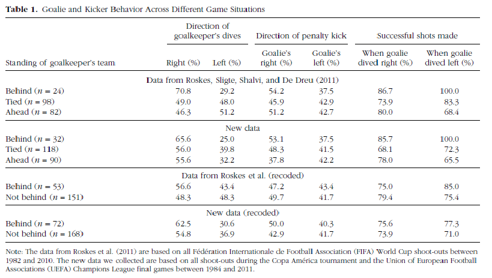

#### Article ID: 16-11-2014_PS
#### Pilot 1: Shavit, Yochai Z.
#### Co-pilot: Leibowitz, Kari A.
#### Start date: 11/1/2017
#### End date: 11/5/2017  

-------

#### Methods summary: 
Price and Wolfers attempted to replicate the findings reported in Roskes, Sligte, Shalvi, & DeDreu (2011), that when their team is behind goalkeeprs tend to jump to their right side during penalty kicks, thus exhibiting a right-oriented bias resulting from approach motivation. 

In the current article, the authors recorded data on 240 penalty kicks taken during penalty kick shoot-outs of matches in the UEFA champions league's final games and the Copa America soccer competitions, between the years 1984 and 2011. For each penalty kick the following information was coded by three independent observers: The keeper's team position during the kick (leading, tied, or behind), the direction of the penalty taker's shot (left, middle, or right), the direction in which the goalkeeper dove (left, middle, or right), and the outcome of the shot (score, save, or off-target). Coders were in general agreement with one another (agreed on 93% of penalty kicks and consensus was achieved for the remaining 7%).

**That the authors collected all this data is an assumption the pilots of the current report are making based on the authors statment that they collected the data "in the same way" as Roskes et al** (who report collecting the above mentioned variables). Price and Wolfers report only the precent of shots and dives to the right and left (no report on middle, though because the percentages of right and left do not always add to 100, it is reasonable to assume that data on 'middle' was also collected but was not deemed important for report. 

Presumably, the authors conducted a series of chi-square tests of proportions to determine whether goalkeepers where more likely to dive to their right when their team was behind, compared to when the score was tied, or their team was ahead. The authors **do not indicate directly which test they used**, but this seems to be a reasonable way to compare percents from independent groups (i.e, when the percents don't add up to 100). [INSUFFICIENT INFORMATION]

In addition, the authors recoded the data giving a different meaning to the condition "goalkeeper's team is behind". While Roskes et al. looked at the score, Price and Wolfers also considered situations in which the team had more missed shots during the shoot-out as being "behind" reasoning that in these conditions the keeper would have a strong approach motivation. **The authors do not indicate whether this varaible was computed from the data or coded by idependent observers.** but do provide this information in their data
```{r echo=FALSE, include=T}
insufficient=1
```

*in sum*- from the methods section alone, there is `r insufficient` insufficient information errors.

------

#### Target outcomes: 
**For the $\chi^2$ proportion tests:**
Number of cases for the goalkeepers team being behind/ahead/ score is tied= 32, 90, 118 respectively.

Percent of goalkeepers' dives to the their right when their team is behind= 65.6%

Percent of goalkeepers' dives to the their right when the score is tied= 56.0%

Percent of goalkeepers' dives to the their right when their team is ahead= 55.6%

No p-value greater then 0.05 in any pairwise comparison.

**Additional descriptive data reported in *table 1*:** 

Percent of goalkeepers' dives to their left when their team is behind/ ahead/ score is tied = 25.0%, 32.2%, and 39.8% respectively.

Percent of penalty kicks to goalkeepers' right when their team is behind/ ahead/ score is tied = 53.1%, 37.8%, and 48.3% respectively.

Percent of penalty kicks to goalkeepers' left when their team is behind/ ahead/ score is tied = 37.5%, 42.2%, and 41.5% respectively.

Percent successful shots when goalkeepers dove right when their team was behind/ ahead/ score is tied = 85.7%, 78.0%, and 68.1% respectively.

Percent successful shots when goalkeepers dove left when their team was behind/ ahead/ score is tied = 100%, 65.5%, and 72.3% respectively.

*Recoded data (behind= more shots missed)*

Number of cases in which the goalkeepe's team was behind/ not behind= 72, 168 respectively.

Percent of goalkeepers' dives to their right when their team is behind/ not behind= 62.5% and 54.8% respectively.

Percent of goalkeepers' dives to their left when their team is behind/ not behind= 30.6% and 36.9% respectively.

Percent of penalty kicks to goalkeepers' right when their team is behind/ not behind = 50.0% and 42.9% respectively.

Percent of penalty kicks to goalkeepers' left when their team is behind/ not behind = 40.3% and 41.7% respectively.

Percent successful shots when goalkeepers dove right when their team was behind/ not behind = 75.6% and 73.9% respectively.

Percent successful shots when goalkeepers dove left when their team was behind/ not behind = 77.3% and 71.0% respectively.

*Figure 1. Price & Wolfers descriptive table*


------


```{r global_options, include=FALSE}
knitr::opts_chunk$set(echo=TRUE, warning=FALSE, message=FALSE)
```

## Step 1: Load packages

```{r}
library(tidyverse) # for data munging
library(knitr) # for kable table formating
library(haven) # import and export 'SPSS', 'Stata' and 'SAS' Files
library(readxl) # import excel files
library(CARPSreports) # custom report functions
library(car)
library(pander)
```

## Step 2: Load data

```{r}
df=read_dta("data/price_wolfers.dta")
```

## Step 3: Tidy data

```{r}
#First- retain only the variables that were recorded: direction of shot, direction of dive, what was the result of the kick and what was the score at the time.

df_tidy=df%>%select(id=id,team_pos=keeper_score, new_pos=new_score, shot_dir=directionshot, dive_dir=directiondive, rslt=result2, score=score)

#data structure
#str(df_tidy) #-> all of these are charachters. should be changed to factors
df_tidy$id=as.factor(df_tidy$id)
df_tidy$team_pos=as.factor(df_tidy$team_pos)
df_tidy$new_pos=as.factor(df_tidy$new_pos)
df_tidy$shot_dir=as.factor(df_tidy$shot_dir)
df_tidy$dive_dir=as.factor(df_tidy$dive_dir)
df_tidy$rslt=as.factor(df_tidy$rslt)
df_tidy$score=as.factor(df_tidy$score)

#Second- recode values of 'team_pos' to match what is reported in table 1
df_tidy$team_pos=recode(df_tidy$team_pos, "'a_behind'='1.Behind'; 'atie'='2.Tie'; 'z_ahead'='3.Ahead'", as.factor.result = T)
```

## Step 4: Run analysis

### Pre-processing

```{r}
 #set an object for number of shots in each position condition (team_pos and pos_new)
n_behind_old=sum(df_tidy$team_pos=="1.Behind")
n_tie_old=sum(df_tidy$team_pos=="2.Tie")
n_ahead_old=sum(df_tidy$team_pos=="3.Ahead")

n_behind_new=sum(df_tidy$new_pos=='behind')
n_not_new=sum(df_tidy$new_pos=='not behind')

#Recode shot_direction to reflect the direction from the goalie's perspective (rather than that of the penalty-taker's shot)
df_tidy$shot_dir_rv=recode(df_tidy$shot_dir, "'right'='left'; 'center'='center'; 'left'='right'")
```

### Descriptive statistics

```{r}
#first- count the number of cases in each 'pos' condition
pos_old=table(df_tidy$team_pos)
pos_new=table(df_tidy$new_pos)
```
At first, we wanted to make sure that we can get the same number of "behind", "tie", and "ahead" cases in the Roskes et al. coding scheme, and the same number of "behind" and "not behind" cases in the new coding scheme.

`r pander(pos_old, caption="table 1: Case counts- Old coding")`

`r pander(pos_new, caption="table 2: Case counts- New coding")`

As can be seen from the tables above- the counts are the same as those reported in Price & Wolfers' table 1 in both cases. 

```{r}
#Now- get the percent values
old_pos=df_tidy%>%group_by(team_pos)%>%summarise(dive_right=sum(dive_dir=='right'), dive_left=sum(dive_dir=='left'), shot_goalie_right=sum(shot_dir_rv=='right'), shot_goalie_left=sum(shot_dir_rv=='left'))%>%ungroup()

old_pos$dive_right[1]=round(((old_pos$dive_right[1]/n_behind_old)*100),1) 
old_pos$dive_right[2]=round(((old_pos$dive_right[2]/n_tie_old)*100),1)
old_pos$dive_right[3]=round(((old_pos$dive_right[3]/n_ahead_old)*100),1)
old_pos$dive_left[1]=round(((old_pos$dive_left[1]/n_behind_old)*100),1)
old_pos$dive_left[2]=round(((old_pos$dive_left[2]/n_tie_old)*100),1)
old_pos$dive_left[3]=round(((old_pos$dive_left[3]/n_ahead_old)*100),1)
old_pos$shot_goalie_right[1]=round(((old_pos$shot_goalie_right[1]/n_behind_old)*100),1)
old_pos$shot_goalie_right[2]=round(((old_pos$shot_goalie_right[2]/n_tie_old)*100),1)
old_pos$shot_goalie_right[3]=round(((old_pos$shot_goalie_right[3]/n_ahead_old)*100),1)
old_pos$shot_goalie_left[1]=round(((old_pos$shot_goalie_left[1]/n_behind_old)*100),1)
old_pos$shot_goalie_left[2]=round(((old_pos$shot_goalie_left[2]/n_tie_old)*100),1)
old_pos$shot_goalie_left[3]=round(((old_pos$shot_goalie_left[3]/n_ahead_old)*100),1)

# one discrepency in the percent of dive_right when the score is tied (55.9 here compared to 56.0 in the article). Is it major?
pe_dr_st=(abs(55.9-56.0)/56.0)*100 #-> no.
```

In the second step, we attempted to recreate the first four cells in the second set of rows in the article's table.1 (percent of dives to the right/left and shots to the right/left based on Roskes et al's 'team position' coding- see figure 1 in this report). 

*Figure 2: zoom-in on % of dives and shots to the goalie's right & left by team position from Price & Wolfers' table 1*


`r pander(old_pos, caption="table 3: % of dives and shots to the goalie's right/left, by team position- Old coding")`

This table is all but identical to the data reported in the article's table 1, however, we found one *minor* numerical error: in our replication, goalkeepers dove to their right 55.9% of the time when the score was tied. Price & Wolfers report 56.0% of the time. The percent error (PE) for this numerical error is `r round(pe_dr_st,2)`%

CARPS report: `r compareValues(reportedValue=56.0, obtainedValue=55.9)`

```{r}
#Next- do the same with the new coding
new_pos=df_tidy%>%group_by(new_pos)%>%summarise(dive_right=sum(dive_dir=='right'), dive_left=sum(dive_dir=='left'), shot_goalie_right=sum(shot_dir_rv=='right'), shot_goalie_left=sum(shot_dir_rv=='left'))%>%ungroup()

new_pos$dive_right[1]=round(((new_pos$dive_right[1]/n_behind_new)*100),1) 
new_pos$dive_right[2]=round(((new_pos$dive_right[2]/n_not_new)*100),1)
new_pos$dive_left[1]=round(((new_pos$dive_left[1]/n_behind_new)*100),1)
new_pos$dive_left[2]=round(((new_pos$dive_left[2]/n_not_new)*100),1)
new_pos$shot_goalie_right[1]=round(((new_pos$shot_goalie_right[1]/n_behind_new)*100),1)
new_pos$shot_goalie_right[2]=round(((new_pos$shot_goalie_right[2]/n_not_new)*100),1)
new_pos$shot_goalie_left[1]=round(((new_pos$shot_goalie_left[1]/n_behind_new)*100),1)
new_pos$shot_goalie_left[2]=round(((new_pos$shot_goalie_left[2]/n_not_new)*100),1)


```

We repeated the same procedure for the new coding to replicate the first four cells in the last set of rows in table 1.

*Figure 3: zoom-in on % of dives and shots to the goalie's right & left by team position (New coding) from Price & Wolfers' table 1*


As can be seen in the table below, we found no discrepencies.

`r pander(new_pos, caption="table 4: % of dives and shots to the goalie's right/left- New coding")`


Next, we attempted to replicate the values in the last two columns of table 1, in row sets 2 & 4 (percent of successful shots when the goalie dove left/ right in each of the "team-position" coding schemes). 

```{r}
##Old coding
#count cases of keepers' dives 
dir_dive_by_teampos=table(df_tidy$dive_dir, df_tidy$team_pos) #-> table with counts
#pull values from table
n_left_b_old=dir_dive_by_teampos[2,1]
n_left_t_old=dir_dive_by_teampos[2,2]
n_left_a_old=dir_dive_by_teampos[2,3]
n_right_b_old=dir_dive_by_teampos[3,1]
n_right_t_old=dir_dive_by_teampos[3,2]
n_right_a_old=dir_dive_by_teampos[3,3]

# Old coding successful shots by direction of dive and team position-count
old_suc=df_tidy%>%filter(dive_dir=="right" | dive_dir=="left")%>%group_by(team_pos, dive_dir)%>%summarise(suc_count=sum(rslt=='goal'))%>%ungroup()

#Recode into percetenge of dives in that direction 
old_suc$suc_count[1]=round(((old_suc$suc_count[1]/n_left_b_old)*100),1)
old_suc$suc_count[2]=round(((old_suc$suc_count[2]/n_right_b_old)*100),1)
old_suc$suc_count[3]=round(((old_suc$suc_count[3]/n_left_t_old)*100),1)
old_suc$suc_count[4]=round(((old_suc$suc_count[4]/n_right_t_old)*100),1)
old_suc$suc_count[5]=round(((old_suc$suc_count[5]/n_left_a_old)*100),1)
old_suc$suc_count[6]=round(((old_suc$suc_count[6]/n_right_a_old)*100),1)

# one discrepency in the percent of successful shots when goalie dove left and the score was tied (68.2 here compared to 68.1 in the article). Is it major?
pe_suc_dr_st=(abs(68.2-68.1)/68.1)*100 #-> no.

##New coding 
#count cases of keepers' dives 
dir_dive_by_newpos=table(df_tidy$dive_dir, df_tidy$new_pos) #-> table with counts
#pull values from table
n_left_b_new=dir_dive_by_newpos[2,1]
n_left_not_new=dir_dive_by_newpos[2,2]
n_right_b_new=dir_dive_by_newpos[3,1]
n_right_not_new=dir_dive_by_newpos[3,2]

# New coding scheme successful shots by direction of dive and team position-count
new_suc=df_tidy%>%filter(dive_dir=="right" | dive_dir=="left")%>%group_by(new_pos, dive_dir)%>%summarise(suc_count=sum(rslt=='goal'))%>%ungroup()

#Recode into percetenge of dives in that direction 
new_suc$suc_count[1]=round(((new_suc$suc_count[1]/n_left_b_new)*100),1)
new_suc$suc_count[2]=round(((new_suc$suc_count[2]/n_right_b_new)*100),1)
new_suc$suc_count[3]=round(((new_suc$suc_count[3]/n_left_not_new)*100),1)
new_suc$suc_count[4]=round(((new_suc$suc_count[4]/n_right_not_new)*100),1)

# no discrepencies
```

As can be seen in the tables below, we found no major differences between the reported values and the reproduced values. For ease, we provide a zoom-in on the relavant columns from Price and wolfers' table 1.

*Figure 4: Price & Wolfers' table 1 percent of successful shots when goalie dove right and left by team position (old coding: behind, tied, ahead )*


`r pander(old_suc, caption="table 5: % successful shots by dive direction and team position- Old coding")`

*Figure 5: Price & Wolfers' table 1 percent of successful shots when goalie dove right and left by team position (New coding: behind, Not behind)*


`r pander(new_suc, caption="table 6: % successful shots by dive direction and team position- New coding")`

We did find one *minor* numerical error, whereby the percent of successful shots when goalie dove left and the score was tied was reported as 68.1% and our replication found it to be `r round(old_suc[4,3], 2)`%. The PE for this numerical error is `r round(pe_suc_dr_st,2)`%

CARPS report: `r compareValues(reportedValue=68.1, obtainedValue=68.2)`


### Inferential statistics
Absent information in Price & Wolfers' article. 

Rosekes et al. report chi-sq tests on the difference between % dives to the right and left in each condition of "team position" but do not seem to directly compare the percenteges of dives to the right to one another.

Going off of the statement that:

> ...smaller difference based on the game situation (65.6% when their team was behind, 56.0% when tied, 55.6% when ahead), **and none of these percentages are statistically significantly different from each other** (Price & Wolfers, 2014, pg.2109)

we reasoned that the authors carried chi-sq tests of given proportions, and proceeded with conducting these tests for each pair of team positions. 

We assume a one sided test for two reasons: The first- the authors were interested to see whether the percents of dives to the right was *greater* when the team was behind compared to when the score was tied or the team was ahead. Second- p values in this test are smaller, making it easier to reject the null given that the difference is in the hypothesized direction (as it is in this case). That means that in order to find 'no significant difference' taking this approach is in fact more conservative. We did not use Yates' continuity correction for that same reason. 

```{r}
# recreate the table of count of dive directions by team position (old coding)
old_pos=df_tidy%>%group_by(team_pos)%>%summarise(dive_right=sum(dive_dir=='right'), dive_left=sum(dive_dir=='left'), shot_goalie_right=sum(shot_dir_rv=='right'), shot_goalie_left=sum(shot_dir_rv=='left'))%>%ungroup()

#number of dives to the right for each of the conditions
dives_right_behind=old_pos$dive_right[1]
dives_right_tied=old_pos$dive_right[2]
dives_right_ahead=old_pos$dive_right[3]

# prop.test for dives to the right when the team was behind vs. when the score was tied
bVt=prop.test(x=c(dives_right_behind, dives_right_tied), n=c(n_behind_old, n_tie_old), alternative = "greater", correct = F)

bVa=prop.test(x=c(dives_right_behind, dives_right_ahead), n=c(n_behind_old, n_ahead_old), alternative = "greater", correct = F)

tVa=prop.test(x=c(dives_right_tied, dives_right_ahead), n=c(n_tie_old, n_ahead_old), alternative = "greater", correct = F)
```

As can be seen in more detail in the tables below, we replicated the results reported by Price & Wolfers under arguably stricter conditions. We too did not find any significant difference between the percentege of dives to the right when the goalkeeper's team was behind, tied, or ahead (all $\chi^2$<1, all *p's*>0.16)

`r pander(bVt, digits=3, caption="table 7: 2-sample test for equality of proportions without continuity correction: 21 dives right out of 32 shots when behind compared to 66 dives right out of 118 shots when tied")`

`r pander(bVa, digits=3, caption="table 8: 2-sample test for equality of proportions without continuity correction: 21 dives right out of 32 shots when behind compared to 50 dives right out of 90 shots when ahead")`

`r pander(tVa, digits=3, caption="table 9: 2-sample test for equality of proportions without continuity correction: 66 dives right out of 118 shots when tied compared to 50 dives right out of 90 shots when ahead")`

## Step 5: Conclusion

CARPS report:

```{r}
 carpsReport(Report_Type = "pilot", 
             Article_ID = "16-11-2014 PS", 
             Insufficient_Information_Errors = 1, 
             Decision_Errors = 0, 
             Major_Numerical_Errors = 0, 
             Time_to_Complete = 360, 
             Author_Assistance = FALSE)
```

We would consider this reproducibility effort as an overall success, if it wasn't for one major caveat- no information on the statistical test used, and therefore no values to compare our results with. The data provided by the authors was complete and well-organized, and did not require any further computations to get any of the key reported values. 

We did not encounter any major numerical errors, indicating that even if the authors did not run their descriptive or inferential analyses on the original data (but rather relied on computed variables, which might be the case since there are computed variables in the provided dataset), it did not effect any of the values.

However, the reproducibility effort was ultimaltely deemed a faliure since the authors did not provide any information in the statistical test they used to come to the conclusion that the percentege of goalkeepers' dives to their right when their team was behind was not different than the percenteges of dives to the right when the goalkeeper's team was tied or ahead. Since there are at least two ways to conduct this analysis (test of proportions or a one-way ANOVA on the number of dives to the right by team-position) their report is not reproducible per se. Having said that, with making a few reasonable assumption we did reproduce the reported no significant differences. We thus consider this an "Insufficient information error" rather than a "decision error". Without any values to compare oue obtained values (reported in tables 7-9) we can not claim to have fully reproduced the reported results. 

## Session info:

```{r session_info, include=TRUE, echo=TRUE, results='markup'}
devtools::session_info()
```
